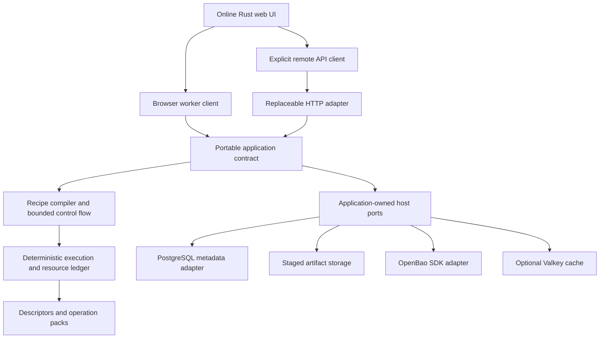

# Runasmidja Architecture

Status: product contract; only the foundation is implemented.

The supplied [architecture](reference/workbench-plan/ARCHITECTURE.md) and
[risk register](reference/workbench-plan/PARITY_AND_RISK_REGISTER.md) are design
inputs. This document records Runasmidja-specific decisions; the implementation
and release plans are authoritative when a source-bundle version differs.

## Dependency direction

Core types never expose database rows, Tokio handles, framework requests,
browser objects or provider-owned TLS types. Browser/native execution shares
operation semantics, not necessarily serialization or thread bounds.

## Data and execution

Typed values distinguish raw bytes, encoded text, records, lossless structure,
tables/media, file collections and scoped artifact handles. Offsets are checked
64-bit values; JSON uses exact representations instead of unsafe JavaScript
number conversion. SecretRef values are scoped capabilities; derived sensitivity
propagates unless an explicitly reviewed rule permits declassification.

A step reports consumed/produced counts and NeedInput/NeedOutput/Yield/Finished.
Streaming, reduction, bounded-window, seekable and whole-input operations have
distinct resource declarations. EOF, finish, errors and cancellation are explicit
states. Transport partitions must not change results. Charge allocation capacity,
provider memory, carry buffers, queues, fan-out lifetime, previews and artifacts.

Use deterministic cooperative execution with bounded queues and fair joins.
Backwards jumps and nested flow use bounded IR regions or a compatibility
interpreter with total-work/output limits. Every run owns child work and cleanup.
The browser can terminate/recreate workers; the server can terminate isolated
worker processes. Stale generations/fencing tokens cannot publish successful
artifacts. Authenticated decryption stays staged until final integrity succeeds.

## Privacy and UI

Serve a normal online website. Default processing happens in a real Dedicated
Worker. Network/upload, local persistence, sharing and secret use are separate
capabilities. Failure never silently uploads. Generated descriptor metadata
feeds forms, catalogue, docs and schemas; avoid duplicated argument definitions.

Preserve simple input/recipe/output panes, keyboard navigation, accessible DOM,
manual Run, undo/redo, debugging and paged viewers. A graph is optional.
Raw transformed data cannot become trusted application HTML. Active document
previews receive isolated origins/sandbox policies and no ambient credentials.
Offline bundles include selected packs/models; no hidden third-party CDN fetch.

## Services

PostgreSQL 19 beta 4 is the development baseline, with private runtime/migration
roles and portable repository methods. Durable metadata is separate from bulk
artifacts. Real MySQL conformance and bidirectional logical migration prove the
seam before 1.0; an in-memory fake cannot supply that proof.

OpenBao 2.7.1 supplies secrets. The current dev harness fully initializes it over
TLS, with declarative audit, KV v2, AppRole and revoked bootstrap root. Application
integration later admits current stable openbao SDK features. Runtime processes
never receive recovery shares/root privileges. Production TLS, identity,
renewal, rotation, dynamic DB leases, audit failure and recovery custody require
separate qualification. Single-share local custody is strictly a test shortcut.

Valkey 9.1.2 is optional cache acceleration, with scoped ACLs, TTL and byte limits.
Only completed deterministic nonsensitive results or bounded metadata are eligible.
Cache identity includes semantic/provider/data revisions and canonical framing;
it is partition-independent and workspace scoped. Permission checks use
current authority. Cold cache/outage/eviction cannot lose authoritative data.

Operation search uses local descriptors. Saved-recipe search starts in repository
adapters with permission filtering. Meilisearch is a conditional service after
benchmarks establish a need. Its index must be rebuildable from metadata via an
outbox; revocation/deletion and tenant isolation are mandatory. Inputs, decrypted
outputs, secrets and run payloads never enter an index.

## Future extraction

HTML/HTTP behavior stays behind Runasmidja-owned seams for Vef. Analysis crypto,
secret lifecycles and native/database TLS stay isolated for Brynja. Neither
sibling API is fabricated and neither directory is a default dependency.
Inventory all hidden outbound HTTP/TLS consumers, including SDKs and identity
metadata. Adapter tests cover framing, backpressure, cancellation, trust/name
verification, ALPN, redirects, errors and protocol-specific database negotiation.
Browser TLS cannot be replaced by a Wasm TLS provider.
